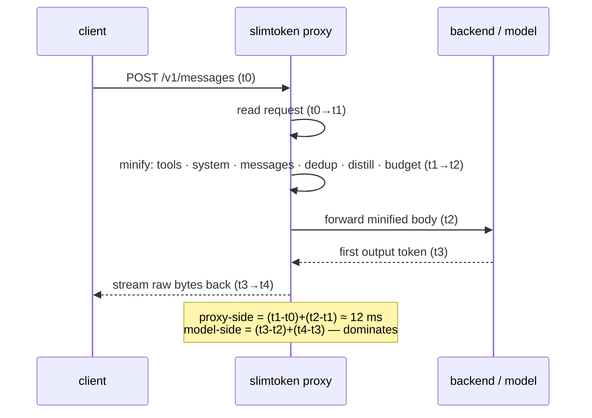
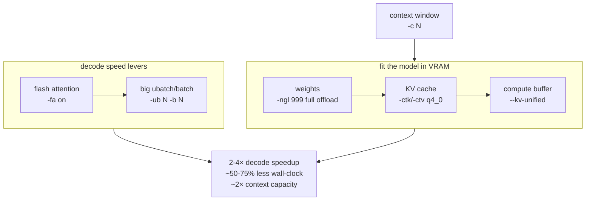

# slimtoken

🔀 A token-optimization layer that sits between an Anthropic-compatible client and
its backend — a local llama-server or a cloud API — and rewrites every request to
use **fewer tokens** before forwarding it.

Tool schemas are trimmed, the system prompt is compressed, old turns are
distilled, repeated tool results are collapsed, and (opt-in) tool output is
type-compressed. Fewer input tokens → faster prompt-eval, lower cost, more
context headroom. It also ships a backend optimizer that recommends
llama-server arguments tuned to your GPU.

You can use slimtoken three ways — **all driven by the same core pipeline, none
reimplemented**:

| Way | How | Best for |
|-----|-----|----------|
| 🔀 **Proxy** | Point `ANTHROPIC_BASE_URL` / `OPENAI_BASE_URL` / `OLLAMA_HOST` at `slimtoken serve` | Transparent, always-on — works with any Anthropic, OpenAI, or Ollama client that honors those env vars (Claude Code, curl, SDKs) |
| 🛠️ **MCP server** | `slimtoken-mcp` over stdio | Hosts that speak MCP (Claude Desktop, ADK, Cursor, Gemini CLI) — call pipeline functions as tools |
| 📦 **Agent Skill + CLI** | `slimtoken optimize` / `slimtoken presets` / `slimtoken high-context` | On-demand minification + VRAM configs from a script or a skill-loaded agent |

MIT-licensed. Ships with `orjson`, `xxhash`, and `tiktoken` for fast JSON,
hashing, and real token counting. Every **lossless** optimization is on by
default — no opt-in flags, only opt-out kill-switches. The two **lossy** modes
(tool compression, output filtering) are opt-in.

## Install

```bash
pip install slimtoken

# Proxy: wire ANTHROPIC_BASE_URL at the proxy, then run it
slimtoken install
slimtoken serve --upstream http://127.0.0.1:8082        # local llama-server
slimtoken serve --upstream https://api.anthropic.com   # or cloud

# CLI: minify a request body on demand
slimtoken optimize -i request.json                     # default profile: aggressive
slimtoken presets --measure                            # local-model table + measured reduction

# MCP server: stdio JSON-RPC for MCP clients
slimtoken-mcp                                          # or: python -m slimtoken.mcp_server
```

Uninstall the proxy wiring: `slimtoken uninstall` (or `bash scripts/uninstall.sh`).

`slimtoken install` only writes a marker block to your shell rc that exports
`ANTHROPIC_BASE_URL` (prior value backed up to `~/.slimtoken/prev_env` and restored
on uninstall). It never touches `settings.json`, `CLAUDE.md`, or `mcp.json`, so
removal is clean and fully reversible.

## How it works — the proxy optimization stack

A six-stage minify pipeline runs on each request, all on by default. The diagram
shows the request lifecycle with the `t0–t4` latency boundaries the proxy records
per request — **proxy-side work** (ingress + optimize) is what slimtoken controls;
**model-side** (forward → first token → final token) is where real time goes.



| Stage | What it does |
|-------|--------------|
| 🧰 tools | Drop `$comment` / `title` / `examples` from schemas; keep `name`, `required`, `enum`, `type`, structure. Compress each `description` to its first fenced example. |
| 📋 system | Collapse whitespace and duplicate banner lines outside code fences; preserve `<tag>` markers and fenced code byte-for-byte. |
| 💬 messages | Collapse blank-line runs and trailing whitespace in text blocks; pass `tool_use` / `tool_result` / `image` blocks untouched. |
| 🔄 dedup | Collapse repeated `tool_result` contents; latest kept verbatim, older copies stubbed. |
| 📝 distill | Truncate old assistant prose beyond the last `SLIMTOKEN_KEEP_LAST` (8) turns to 240 chars/turn. Fence-aware, preserves tool blocks, no model call. |
| 🎯 budget | Hard token cap (`SLIMTOKEN_MINIFY_BUDGET`, 131072); drops a leading prefix pair-safely — only when over budget. |

**Safety guarantees** — code fences (``` / ~~~) preserved byte-identical; pruning
is pair-safe (a `tool_result` is never orphaned from its `tool_use`); identity-based
change detection returns unchanged content zero-copy; the `grammar` field is
stripped from request bodies.

## Input optimization (total)

Total input-token reduction, default config (all stages on), **measured by the
pipeline itself** on representative payloads — not asserted:

| Scenario | safe | aggressive |
|----------|-----:|-----------:|
| Typical session (~500 tok) | 9.0% | 9.0% |
| Bloated session (repeated file reads + verbose history, ~30k tok) | 73.3% | 85.4% |
| End-to-end vs a live llama-server (model-reported) | — | **11.7%** (1,164 → 1,028 tok) |

Run the measurement yourself:

```bash
slimtoken presets --measure                    # recompute the table above on your machine
python3 bench/benchmark.py                     # payload + latency breakdown
python3 bench/benchmark.py --backend http://127.0.0.1:8082   # + end-to-end vs a live backend
slimtoken latency                             # one request → t0-t4 printout
```

Proxy latency is ~12 ms per request (optimize stage, warm) — negligible next to
any LLM round-trip. The win is **fewer tokens sent**, not proxy speed. The
`t0–t4` instrumentation separates slimtoken's work from model generation so you
can see exactly that.

### Profiles

Two named presets over the existing config knobs — no new heuristics.
`aggressive` is the default; `safe` is the lossless escape hatch:

| profile | stages | lossy? | token_budget | keep_last | use when |
|---------|--------|:------:|-------------:|----------:|----------|
| `aggressive` | tools · system · messages · dedup · distill · tool_compress | **yes** | 131072 | 4 | **default** — most context headroom; trades a little fidelity for compression |
| `safe` | tools · system · messages · dedup | no | 0 (off) | 8 | exact fidelity — debugging, or the model must see raw tool output verbatim |

## Backends — Anthropic, OpenAI, and Ollama

The proxy routes by URL path and the CLI/MCP accept a `--format` / `format` arg.
The minify pipeline is built around Anthropic's request shape; OpenAI and Ollama
bodies are normalized to that canonical form, minified, then converted back — a
thin adapter layer, **no optimization logic is duplicated**. The Anthropic path is
identity (zero work, byte-identical to before).

| path | format | conversion |
|------|--------|------------|
| `/v1/messages` | `anthropic` | none (identity) |
| `/v1/chat/completions` | `openai` | `role:"system"` → top-level `system`; `assistant.tool_calls` → `tool_use` blocks; `role:"tool"` → `tool_result` blocks; `function.parameters` → `input_schema` |
| `/api/chat`, `/api/generate` | `ollama` | reuses the OpenAI conversion; Ollama-only fields (`options`, `format`, `keep_alive`) pass through |

Pair-safety is preserved across the round trip: an assistant tool call plus its
following `role:"tool"` replies become Anthropic `tool_use` + `tool_result` blocks,
the pipeline drops such pairs together, and the reverse conversion never orphans a
tool result from its call.

```bash
# proxy: point any of these at slimtoken; it detects the format from the path
export OPENAI_BASE_URL=http://127.0.0.1:8181/v1     # OpenAI clients → /v1/chat/completions
export OLLAMA_HOST=127.0.0.1:8181                    # Ollama clients → /api/chat
slimtoken serve --upstream http://127.0.0.1:11434   # → your local Ollama

# CLI: minify an OpenAI/Ollama body directly
slimtoken optimize -f openai  -i req.json
slimtoken optimize -f ollama  -i req.json
```

## Local-model presets by VRAM

Recommended configs for common local models grouped by GPU VRAM tier, each with a
slimtoken profile and usable context (KV cache + overhead eat into the nominal
max). The **reduction** column is the live measured token drop that model's
recommended profile achieves on the bloated payload — computed by the pipeline,
not hand-waved (`slimtoken presets --measure`).

| VRAM | model | quant | usable ctx | profile | reduction |
|-----:|-------|-------|----------:|---------|--------:|
| 4 GB | Llama 3.2 3B | Q4_K_M | 8 192 | aggressive | 85.4% |
| 4 GB | Qwen 2.5 3B | Q4_K_M | 32 768 | aggressive | 85.4% |
| 4 GB | Phi-4 Mini | Q4_0 | 16 384 | aggressive | 85.4% |
| 8 GB | LFM2.5-8B-A1B (MoE, 1.5B active) | Q4 | 32 768 | aggressive | 85.4% |
| 8 GB | Qwen 2.5 7B | Q4_K_M | 32 768 | aggressive | 85.4% |
| 8 GB | Gemma 3 12B | Q4 | 16 384 | aggressive | 85.4% |
| 16 GB | Qwen 3 14B | Q4_K_M | 65 536 | aggressive | 85.4% |
| 16 GB | Mistral Nemo 12B | Q4_K_M | 131 072 | aggressive | 85.4% |
| 16 GB | Llama 3.1 8B | Q4_K_M | 131 072 | aggressive | 85.4% |

> Reduction is **profile-dependent, not model-dependent** — the pipeline
> rewrites the request regardless of which model consumes it. The table maps each
> tier to its recommended profile; the reduction shown is what that profile
> delivers on a bloated payload. On a typical session both profiles reduce ~9%.

## Effective context window — dense vs MoE

Because slimtoken compresses input ~85%, a model's nominal context window holds
**far more raw conversation** than its size suggests. The effective capacity is
`nominal_ctx / (1 − reduction)`. The presets below push each tier to the largest
nominal context that **fits fully in VRAM** (q4_0 KV, flash attention, full GPU
offload, `--kv-unified`) — computed by the backend optimizer, not asserted — and
show the effective raw-token capacity with compression. Each tier has both a
**dense** and a **MoE/Mamba-hybrid** option: hybrids (Qwen3.6-35B-A3B, LFM2.5-8B-A1B)
have ~5 KB/token KV vs ~30 KB/token for dense, so they reach far larger contexts on
the same VRAM.

```bash
slimtoken high-context                 # full table (all tiers, dense + MoE)
slimtoken high-context --vram-gb 16    # one tier
slimtoken high-context --vram-gb 16 --detail   # + the llama-server commands
```

| tier | kind | model | quant | nominal ctx | total GB | margin | effective ctx |
|-----:|------|-------|-------|------------:|---------:|-------:|-------------:|
| 4 GB | dense | Llama 3.2 3B | Q4_K_M | 16 384 | 3.67 | +0.33 | ~112 k |
| 4 GB | MoE | LFM2.5-8B-A1B | IQ2_S | 32 768 | 3.91 | +0.09 | ~224 k |
| 8 GB | MoE | LFM2.5-8B-A1B | Q4_K_M | 131 072 | 7.33 | +0.67 | ~898 k |
| 8 GB | dense | Llama 3.1 8B | Q4_K_M | 32 768 | 7.71 | +0.29 | ~224 k |
| 16 GB | MoE | Qwen3.6-35B-A3B | IQ3_S | 131 072 | 14.16 | +1.84 | ~898 k |
| 16 GB | dense | Llama 3.1 8B | Q4_K_M | 262 144 | 14.71 | +1.29 | ~1.8 M |

> The 16 GB MoE row is capped at **128 k** — the proven-stable value on a 16 GB
> card (256 k OOMs at ub=2048; 128 k@ub512 measured 13.7 GB). The 8 GB MoE row is
> capped at 128 k too (256 k is a razor fit, ~+0.04 GB margin — any VRAM spike
> spills it; 128 k leaves ~0.67 GB headroom). The 4 GB MoE at 2-bit is a quality
> trade-off — the dense 3B is usually the better 4 GB pick. All configs use q4_0
> KV (`-ctk q4_0 -ctv q4_0`) matching a proven local llama-server setup.

## MCP server

`slimtoken-mcp` exposes the pipeline as MCP tools over **stdio** (the transport
every local MCP client uses). It is a thin adapter: every tool imports and calls
an existing core function — **no optimization is reimplemented**. The proxy and
the MCP server are independent processes that share the same library.

| Tool | Calls | What it returns |
|------|-------|-----------------|
| `slimtoken.optimize_messages` | `minify_request` + profile | minified messages/system/tools + token counts + per-stage stats |
| `slimtoken.estimate_tokens` | `count_obj` / `count_messages` | total + per-message token breakdown (cl100k, bundled) |
| `slimtoken.prune_context` | `prune_context` | a ready-to-inject `<cold_memory>/<recent_context>` prompt block |
| `slimtoken.minify_tool_result` | `compress_content` | a type-compressed tool_result content block (lossy) |
| `slimtoken.inspect_budget` | `count_*` + `enforce_budget` | read-only token-budget headroom + would-drop count |
| `slimtoken.get_config` | `profile_config` / `build_minify_cfg` | the active MinifyConfig (profile or env-derived) |
| `slimtoken.list_model_presets` | `preset_with_reduction` | VRAM-tier presets, optionally with live measured reduction |
| `slimtoken.high_context_presets` | `list_context_presets` | high-context dense+MoE presets per tier, with effective context after compression |

`optimize_messages`, `estimate_tokens`, and `inspect_budget` accept a `format`
field (`anthropic` / `openai` / `ollama`); non-anthropic bodies are normalized to
canonical before the pipeline runs and returned in the caller's format.

Wire it into an MCP client's stdio config (example for Claude Desktop /
`claude_desktop_config.json`):

```json
{
  "mcpServers": {
    "slimtoken": {
      "command": "slimtoken-mcp"
    }
  }
}
```

The server speaks the MCP JSON-RPC 2.0 protocol (initialize → tools/list →
tools/call), protocol version `2024-11-05`, and is self-contained (stdlib only on
top of slimtoken's existing deps). It does no optimization itself — every call
dispatches to the core pipeline.

## Agent Skill

The `skills/slimtoken-optimizer/` directory is a packaged **Agent Skill** (static
files a host agent runtime — Claude Code, ADK, Gemini CLI, Cursor — reads from
disk on activation, not a running process). It is **model-agnostic** and works
with local, cloud, or uncensored models: it rewrites the request, not the model.

```
skills/slimtoken-optimizer/
  SKILL.md                          # L1 description (~50 tok) + L2 body (<800 tok)
  references/optimization-policies.md  # full stage list + pair-safety rules (loaded on demand)
  scripts/optimize.py               # wrapper: CLI primary, MCP stdio fallback
```

The wrapper shells out to the `slimtoken` CLI when available, and falls back to a
one-shot MCP stdio call (`slimtoken-mcp`) when only the MCP server is installed —
so the skill works regardless of which surface the host has:

```bash
python3 skills/slimtoken-optimizer/scripts/optimize.py optimize -i req.json -p aggressive
python3 skills/slimtoken-optimizer/scripts/optimize.py presets --vram-gb 16 --measure
python3 skills/slimtoken-optimizer/scripts/optimize.py estimate -i req.json
```

Drop the `skills/slimtoken-optimizer/` directory into your agent's skill search
path and the host runtime surfaces it when a prompt matches "shrink / minimize /
trim tokens / context too long".

## Lossy modes (opt-in)

Two modes are **off by default** because they discard information. Enable them
only when the trade-off is worth it.

| Mode | Env | What it does |
|------|-----|--------------|
| 🗜️ tool compression | `SLIMTOKEN_TOOL_COMPRESS=1` | Replace large `tool_result` content with a compact, type-detected representation (directory listings, git output, logs, JSON, source) + a `[slimtoken-compressed] N B -> M B` metadata header. Pair-safe — only the `content` field changes. |
| ✂️ output filter | `SLIMTOKEN_MAX_TOKENS=N` / `SLIMTOKEN_STOP=a,b` | Enforce a max output-token cap (counted with the real tokenizer) and/or stop-sequence truncation on the streamed response. Raw passthrough with zero overhead when unset. |

## Config

Defaults are the recommended values. Set any to `0` to disable.

| Env var | Default | Meaning |
|---------|---------|---------|
| `SLIMTOKEN_MINIFY` | 1 | master switch; 0 = passthrough |
| `SLIMTOKEN_MINIFY_TOOLS` | 1 | |
| `SLIMTOKEN_MINIFY_SYSTEM` | 1 | |
| `SLIMTOKEN_MINIFY_MESSAGES` | 1 | |
| `SLIMTOKEN_MINIFY_DEDUP` | 1 | |
| `SLIMTOKEN_MINIFY_DISTILL` | 1 | |
| `SLIMTOKEN_MINIFY_BUDGET` | 131072 | 0 disables hard prune (distill still runs) |
| `SLIMTOKEN_KEEP_LAST` | 8 | recent turns kept verbatim by distill/budget |
| `SLIMTOKEN_DEDUP_MIN_CHARS` | 200 | only dedup tool results at least this long |
| `SLIMTOKEN_DISTILL_MAX_CHARS` | 240 | max chars per distilled old turn |
| `SLIMTOKEN_MINIFY_TOOL_SKIP` | _(none)_ | comma-list of tool names to never minify |
| `SLIMTOKEN_TOOL_COMPRESS` | 0 | lossy type-specific tool-result compression |
| `SLIMTOKEN_MAX_TOKENS` | _(unset)_ | output-token cap (enables output filter) |
| `SLIMTOKEN_STOP` | _(unset)_ | comma-joined stop sequences (enables output filter) |
| `SLIMTOKEN_HTTP2` | 0 | use HTTP/2 to the upstream |
| `SLIMTOKEN_PORT` | 8181 | listen port |
| `SLIMTOKEN_UPSTREAM` | _(required to serve)_ | backend URL |

`GET /metrics` returns cumulative token counts + the `t0–t4` latency buckets.
TLS for cloud HTTPS upstreams is handled by `httpx` (SNI; optional mTLS via
`SLIMTOKEN_TLS_*`; `SLIMTOKEN_TLS_INSECURE=1` to skip verify). Lazy MCP — one
stub tool per configured MCP server in `~/.slimtoken/lazy_mcp.json`, the real
server spawned on call — is available as a separate entrypoint.

## Backend optimizer — the config-optimization stack



```bash
slimtoken config-optimizer [--model /path/to.gguf] [--vram-gb 16] [--model-size-gb 12.7]
                            [--kv-per-token 5120] [--native-ctx 262144]
```

`config-optimizer` inspects your GPU VRAM and model size, estimates weights
VRAM, KV cache, and the compute buffer, then recommends llama-server arguments
that fit without OOMing. It prints a ready-to-paste `llama-server` command plus
`CORTEXAGENT_*` env exports. It changes nothing itself — recommend-only.

| Option | Flag | What it does | Potential gain |
|--------|------|--------------|----------------|
| 🟢 Full GPU offload | `-ngl 999` | All model layers on GPU. Decode is memory-bandwidth-bound — offloading even a few layers to CPU cripples speed. | The biggest decode lever; often several× vs partial offload. |
| ⚡ Flash attention | `-fa on` | Fused attention kernel; lower VRAM, faster attention. | Largest on long context (up to ~2× on the attention portion). |
| 🗜️ KV cache quant | `-ctk q4_0 -ctv q4_0` | Halves KV cache size. | ~2× context capacity in the same VRAM; modest decode speedup. |
| 📏 Context window | `-c N` | Largest ctx that fits without OOM. | More usable history (capacity, not speed). |
| 📦 Ubatch / batch | `-ub N -b N` | Larger prompt-eval batch. | Faster input processing — compounds with slimtoken's input reduction. |
| 🔗 KV unified | `--kv-unified` | Unified compute buffer (calibrated into the VRAM estimate). | Lower buffer overhead. |
| 🔀 Parallel slots | `-np 1` | 1 slot = max per-request budget (raise for concurrency). | Higher throughput under concurrent load. |

**Total potential:** versus a naive baseline (partial CPU offload + fp16 KV +
no flash attention), enabling all of the above typically yields a **2–4× decode
speedup (≈50–75% less wall-clock per token)** and ~2× context capacity. These
are typical llama.cpp ranges, not measurements taken by slimtoken — the real
figure depends on your starting config. `config-optimizer` computes the largest
safe values for your specific VRAM automatically.

> ⚠️ Estimate only — verify VRAM with `nvidia-smi` under a real prompt before
> trusting the margin. The compute buffer is calibrated for `--kv-unified` on a
> hybrid MoE; dense models or `--kv-budget` change the math.

## Tests

```bash
python3 tests/test_all.py          # 172 checks — core pipeline + proxy + adapters + context presets
python3 tests/test_mcp_server.py   # 60 checks — MCP stdio server (all 8 tools)
```

Cover fence byte-identity, pair-safety, dedup, distill, ≥50% default reduction
on a bloated payload, real-tokenizer counting (no whole-body serialize),
single-pass equivalence, type-compressor pair-safety, output-filter truncation,
async proxy end-to-end, `/metrics` latency buckets, fast-path byte-identical
passthrough, and the full MCP stdio handshake + every tool + the error paths.

## License

MIT, Copyright (c) 2026 greyok00. See [LICENSE](LICENSE).