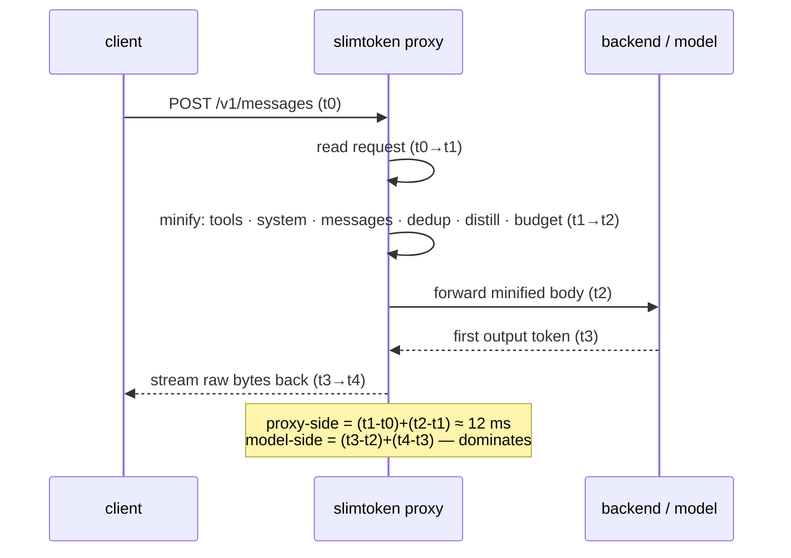
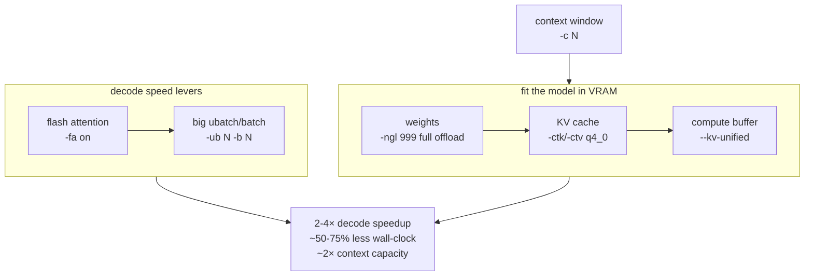

# slimtoken

🔀 A token-optimization proxy that sits between an Anthropic-compatible client
and its backend — a local llama-server or a cloud API.

It rewrites every request to use **fewer tokens** before forwarding it: tool
schemas are trimmed, the system prompt is compressed, old turns are distilled,
repeated tool results are collapsed, and (opt-in) tool output is type-compressed.
Fewer input tokens → faster prompt-eval, lower cost, more context headroom. It
also ships a backend optimizer that recommends llama-server arguments tuned to
your GPU.

Point `ANTHROPIC_BASE_URL` at it. MIT-licensed. Ships with `orjson`, `xxhash`,
and `tiktoken` for fast JSON, hashing, and real token counting. Every
lossless optimization is **on by default** — there are no opt-in flags, only
opt-out kill-switches. The two lossy modes (tool compression, output filtering)
are opt-in.

## Install

```bash
bash scripts/install.sh                                # wires ANTHROPIC_BASE_URL
slimtoken serve --upstream http://127.0.0.1:8082       # local llama-server
slimtoken serve --upstream https://api.anthropic.com  # or cloud
```

Uninstall: `bash scripts/uninstall.sh` (or `slimtoken uninstall`).

Install only writes a marker block to your shell rc that exports
`ANTHROPIC_BASE_URL` (prior value backed up to `~/.slimtoken/prev_env` and
restored on uninstall). It never touches `settings.json`, `CLAUDE.md`, or
`mcp.json`, so removal is clean and fully reversible.

## How it works — the proxy optimization stack

A six-stage minify pipeline runs on each request, all on by default. The
diagram shows the request lifecycle with the `t0–t4` latency boundaries the
proxy records per request — **proxy-side work** (ingress + optimize) is what
slimtoken controls; **model-side** (forward → first token → final token) is
where real time goes.



| Stage | What it does |
|-------|--------------|
| 🧰 tools | Drop `$comment` / `title` / `examples` from schemas; keep `name`, `required`, `enum`, `type`, structure. Compress each `description` to its first fenced example. |
| 📋 system | Collapse whitespace and duplicate banner lines outside code fences; preserve `<tag>` markers and fenced code byte-for-byte. |
| 💬 messages | Collapse blank-line runs and trailing whitespace in text blocks; pass `tool_use` / `tool_result` / `image` blocks untouched. |
| 🔄 dedup | Collapse repeated `tool_result` contents; latest kept verbatim, older copies stubbed. |
| 📝 distill | Truncate old assistant prose beyond the last `SLIMTOKEN_KEEP_LAST` (8) turns to 240 chars/turn. Fence-aware, preserves tool blocks, no model call. |
| 🎯 budget | Hard token cap (`SLIMTOKEN_MINIFY_BUDGET`, 131072); drops a leading prefix pair-safely — only when over budget. |

**Safety guarantees** — code fences (``` / ~~~) preserved byte-identical;
pruning is pair-safe (a `tool_result` is never orphaned from its `tool_use`);
identity-based change detection returns unchanged content zero-copy; the
`grammar` field is stripped from request bodies.

## Input optimization (total)

Total input-token reduction, default config (all stages on):

| Scenario | Reduction |
|----------|----------:|
| Typical session | ~15% |
| Bloated session (repeated file reads + verbose history) | up to **81%** |
| End-to-end, model-reported vs a live llama-server | **11.7%** (1,164 → 1,028 tokens) |

Proxy latency is ~12 ms per request (optimize stage, warm) — negligible next to
any LLM round-trip. The win is **fewer tokens sent**, not proxy speed. The
`t0–t4` instrumentation separates slimtoken's work from model generation so you
can see exactly that:

```bash
python3 bench/benchmark.py                                 # payload + latency breakdown
python3 bench/benchmark.py --backend http://127.0.0.1:8082  # + end-to-end vs a live backend
slimtoken latency                                          # one request → t0-t4 printout
```

## Lossy modes (opt-in)

Two modes are **off by default** because they discard information. Enable them
only when you know the trade-off is worth it.

| Mode | Env | What it does |
|------|-----|--------------|
| 🗜️ tool compression | `SLIMTOKEN_TOOL_COMPRESS=1` | Replace large `tool_result` content with a compact, type-detected representation (directory listings, git output, logs, JSON, source) + a `[slimtoken-compressed] N B -> M B` metadata header. Pair-safe — only the `content` field changes. |
| ✂️ output filter | `SLIMTOKEN_MAX_TOKENS=N` / `SLIMTOKEN_STOP=a,b` | Enforce a max output-token cap (counted with the real tokenizer) and/or stop-sequence truncation on the streamed response. Raw passthrough with zero overhead when unset. |

## Config

Defaults are the recommended values. Set any to `0` to disable.

| Env var | Default | Meaning |
|---------|---------|---------|
| `SLIMTOKEN_MINIFY` | 1 | master switch; 0 = passthrough |
| `SLIMTOKEN_MINIFY_TOOLS` | 1 | |
| `SLIMTOKEN_MINIFY_SYSTEM` | 1 | |
| `SLIMTOKEN_MINIFY_MESSAGES` | 1 | |
| `SLIMTOKEN_MINIFY_DEDUP` | 1 | |
| `SLIMTOKEN_MINIFY_DISTILL` | 1 | |
| `SLIMTOKEN_MINIFY_BUDGET` | 131072 | 0 disables hard prune (distill still runs) |
| `SLIMTOKEN_KEEP_LAST` | 8 | recent turns kept verbatim by distill/budget |
| `SLIMTOKEN_DEDUP_MIN_CHARS` | 200 | only dedup tool results at least this long |
| `SLIMTOKEN_DISTILL_MAX_CHARS` | 240 | max chars per distilled old turn |
| `SLIMTOKEN_MINIFY_TOOL_SKIP` | _(none)_ | comma-list of tool names to never minify |
| `SLIMTOKEN_TOOL_COMPRESS` | 0 | lossy type-specific tool-result compression |
| `SLIMTOKEN_MAX_TOKENS` | _(unset)_ | output-token cap (enables output filter) |
| `SLIMTOKEN_STOP` | _(unset)_ | comma-joined stop sequences (enables output filter) |
| `SLIMTOKEN_HTTP2` | 0 | use HTTP/2 to the upstream |
| `SLIMTOKEN_PORT` | 8181 | listen port |
| `SLIMTOKEN_UPSTREAM` | _(required to serve)_ | backend URL |

`GET /metrics` returns cumulative token counts + the `t0–t4` latency buckets.
TLS for cloud HTTPS upstreams is handled by `httpx` (SNI; optional mTLS via
`SLIMTOKEN_TLS_*`; `SLIMTOKEN_TLS_INSECURE=1` to skip verify). Lazy MCP — one
stub tool per configured MCP server in `~/.slimtoken/lazy_mcp.json`, the real
server spawned on call — is available as a separate entrypoint.

## Backend optimizer — the config-optimization stack



```bash
slimtoken config-optimizer [--model /path/to.gguf] [--vram-gb 16] [--model-size-gb 12.7]
                            [--kv-per-token 5120] [--native-ctx 262144]
```

`config-optimizer` inspects your GPU VRAM and model size, estimates weights
VRAM, KV cache, and the compute buffer, then recommends llama-server arguments
that fit without OOMing. It prints a ready-to-paste `llama-server` command plus
`CORTEXAGENT_*` env exports. It changes nothing itself — recommend-only.

| Option | Flag | What it does | Potential gain |
|--------|------|--------------|----------------|
| 🟢 Full GPU offload | `-ngl 999` | All model layers on GPU. Decode is memory-bandwidth-bound — offloading even a few layers to CPU cripples speed. | The biggest decode lever; often several× vs partial offload. |
| ⚡ Flash attention | `-fa on` | Fused attention kernel; lower VRAM, faster attention. | Largest on long context (up to ~2× on the attention portion). |
| 🗜️ KV cache quant | `-ctk q4_0 -ctv q4_0` | Halves KV cache size. | ~2× context capacity in the same VRAM; modest decode speedup. |
| 📏 Context window | `-c N` | Largest ctx that fits without OOM. | More usable history (capacity, not speed). |
| 📦 Ubatch / batch | `-ub N -b N` | Larger prompt-eval batch. | Faster input processing — compounds with slimtoken's input reduction. |
| 🔗 KV unified | `--kv-unified` | Unified compute buffer (calibrated into the VRAM estimate). | Lower buffer overhead. |
| 🔀 Parallel slots | `-np 1` | 1 slot = max per-request budget (raise for concurrency). | Higher throughput under concurrent load. |

**Total potential:** versus a naive baseline (partial CPU offload + fp16 KV +
no flash attention), enabling all of the above typically yields a **2–4× decode
speedup (≈50–75% less wall-clock per token)** and ~2× context capacity. These
are typical llama.cpp ranges, not measurements taken by slimtoken — the real
figure depends on your starting config. `config-optimizer` computes the largest
safe values for your specific VRAM automatically.

> ⚠️ Estimate only — verify VRAM with `nvidia-smi` under a real prompt before
> trusting the margin. The compute buffer is calibrated for `--kv-unified` on a
> hybrid MoE; dense models or `--kv-budget` change the math.

## Tests

```bash
python3 tests/test_all.py        # 82 checks
```

Covers fence byte-identity, pair-safety, dedup, distill, ≥50% default reduction
on a bloated payload, real-tokenizer counting (no whole-body serialize),
single-pass equivalence, type-compressor pair-safety, output-filter
truncation, async proxy end-to-end, `/metrics` latency buckets, and fast-path
byte-identical passthrough.

## License

MIT, Copyright (c) 2026 greyok00. See [LICENSE](LICENSE).