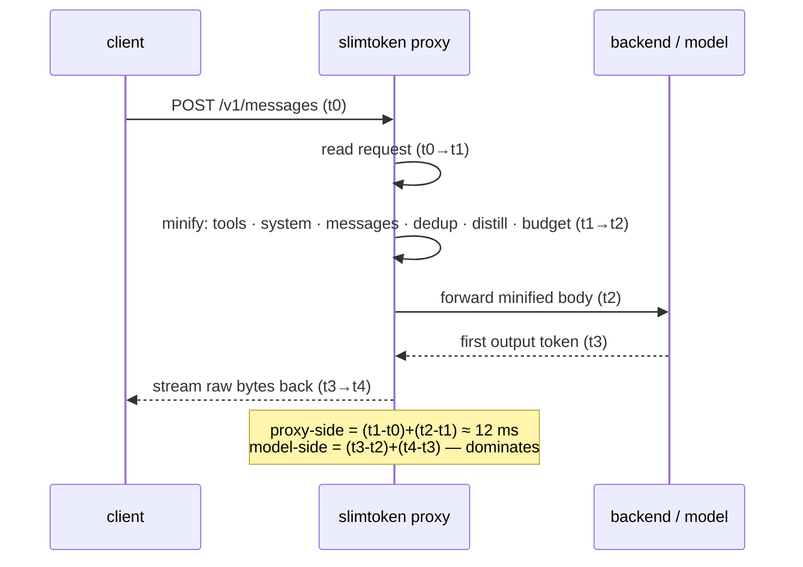
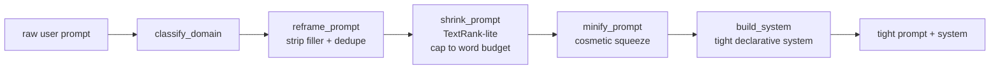
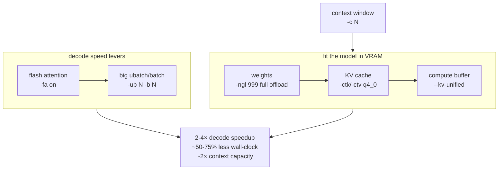

# slimtoken

### What this is

Every LLM call spends tokens — on a bloated system prompt, a tool schema you
wrote twice, an old turn that no longer matters, "Sure!" at the head of every
reply. **slimtoken rewrites the request before it leaves your machine** so the
model sees less, charges less, and answers faster.

It's a small Python toolkit that runs three ways: as an always-on proxy in
front of any Anthropic / OpenAI / Ollama backend, as an MCP server any agent
can call, or imported as a plain library. Same code, same wins either way.
Since v0.5.0 it also ships **`slimtoken.memory`** — a persistent, disk-backed
memory + guard-rail layer for agents (formerly its own project, now merged in).

### Prompt reframe — CPU, not LLM

Alongside the request-body minify pipeline, slimtoken ships **prompt reframe**
— a 1-ms CPU pass that takes a rambling 200-word user prompt and returns a
tight 25-word instruction, with the original intent preserved by construction
(no LLM roundtrip). It's exposed as `slimtoken.prompt_reframe`, an MCP server
(`slimtoken-reframe-mcp`), and an Agent Skill (`skills/prompt-reframe/`).

### What this README is

A measured walkthrough: a one-table token-savings proof, the per-stage pipeline
at a glance, a worked before/after, install + first-call instructions, and links
to the deep reference. MIT-licensed; ships with `orjson`, `xxhash`, and
`tiktoken` so the token counts below are real, not guesstimates.

## Token reduction — measured, not claimed

Every number below is computed by slimtoken's own real cl100k tokenizer on
representative payloads. Run them yourself with `slimtoken presets --measure`.

### Input — the always-on pipeline

The request-side pipeline (tools · system · messages · dedup · distill ·
budget) runs on every request by default and is **lossless**: it only minifies
whitespace, stubs byte-identical duplicate tool results, distills *assistant*
prose beyond the keep-last window, and hard-prunes only when the budget is
exceeded. Old **user** turns (requirements, schemas, constraints) are preserved
verbatim. The lossy stages — `tool_compress` (type-specific tool-result
reduction) and `minify_dom` (HTML pruning) — are **opt-in**, off by default.
Reduction scales with how much waste the session carries:

| Scenario | Before | After | Reduction |
|----------|-------:|------:|----------:|
| Typical coding session (a file re-read 3×, verbose turns) | 772 tok | 507 tok | **−34.3%** |
| Bloated session (6 repeated file reads + verbose history) | 3 312 tok | 1 187 tok | **−64.2%** |
| HTML dump session (10 scraped pages) | 10 894 tok | 1 768 tok | **−83.8%** |

### Output — the filter (on by default)

The response-side filter strips lead-in filler ("Sure!", "Here is the code:",
"Let me know if you need anything else.", …) from the streamed head. **On by
default** — set `SLIMTOKEN_FILLER=0` to disable. The token cap
(`SLIMTOKEN_MAX_TOKENS`) and stop sequences (`SLIMTOKEN_STOP`) are opt-in.

| Scenario | Before | After | Reduction |
|----------|-------:|------:|----------:|
| Short reply with filler lead-in | 44 tok | 38 tok | **−13.6%** |
| Long reply with filler lead-in | 380 tok | 374 tok | **−1.6%** |
| Clean reply (no filler) | 21 tok | 21 tok | 0% (nothing to strip) |

### Combined — one round-trip

Input reduction + output reduction together, on the same session:

| Scenario | Before | After | Reduction |
|----------|-------:|------:|----------:|
| Typical session | 793 tok | 528 tok | **−33.4%** |
| Bloated session | 3 692 tok | 1 561 tok | **−57.7%** |
| HTML dump session | 10 938 tok | 1 806 tok | **−83.5%** |

> **The honest caveat:** reduction is proportional to waste. A clean, short
> session with no repeated content and no filler gets ~0% — slimtoken never
> invents savings. The more a session re-reads files, repeats tool output, or
> carries verbose old turns, the more it saves. That's the point: it removes
> redundancy, not meaning.

## Quick start

**The proxy is the default.** It sits in front of your model API and minifies
**every** request automatically — the agent can't skip it, so you get the savings
without relying on the model to remember to call anything.

```bash
# Local build — Cython-compiled by default (skips gracefully to pure Python)
git clone https://github.com/greyok00/slimtoken
cd slimtoken && ./scripts/install.sh

# or, from PyPI:
pip install slimtoken

# Default setup — the proxy (one command, reversible)
slimtoken install
slimtoken serve --upstream http://127.0.0.1:8080        # local llama-server
# or:  slimtoken serve --upstream https://api.anthropic.com   # cloud

# `slimtoken install` already wired ANTHROPIC_BASE_URL to the proxy.
# Point your client at it and every request is minified automatically.
# Nothing else to do.

# Alternatives (not the default — on-demand only):
#   CLI:    slimtoken optimize -i request.json
#   MCP:    slimtoken-mcp
```

`slimtoken install` writes a marker block to your shell rc that exports
`ANTHROPIC_BASE_URL` to the proxy (prior value backed up to `~/.slimtoken/prev_env`
and restored on uninstall). It never touches `settings.json`, `CLAUDE.md`, or
`mcp.json`, so removal is clean and fully reversible: `slimtoken uninstall`.

### Why the proxy is the default

The proxy is the only surface that guarantees **every** request is minified. MCP
tools and the CLI are on-demand — the agent has to choose to call them, and a
busy agent will forget. The proxy rewrites the request at the API layer, so the
savings happen whether or not the agent "remembers" slimtoken. If you want the
token reduction to actually happen, route through the proxy.

### Disabling the proxy

Some setups don't want automatic minification (exact-fidelity debugging, or a
model that must see raw tool output verbatim). Opt out cleanly:

- **Per-request passthrough:** `SLIMTOKEN_MINIFY=0` — raw passthrough, no rewrite.
- **Don't route through it:** unset `ANTHROPIC_BASE_URL` (or point it at your
  model directly) — the proxy only sees traffic that's sent to it.
- **Full removal:** `slimtoken uninstall` — restores your prior
  `ANTHROPIC_BASE_URL` and removes the marker block.

### Two-profile deploy

One proxy process runs one pipeline. When a box serves two very different
backends, run two instances instead of reconfiguring one:

| Instance | Stages | Sits in front of |
|---|---|---|
| minimal | distill + dedup only — never touches tool schemas or the system prompt | a cloud endpoint, where tool-call fidelity matters most |
| full | every stage + tool compression + DOM minify + keep-last | a local model, where raw context volume is the enemy |

Each instance is one `slimtoken serve --upstream … --port …` with its own env
pins (`MINIFY_TOOLS`, `MINIFY_DISTILL`, `DEDUP`, `TOOL_COMPRESS`, …), so the
stage table in "What it does" doubles as the per-instance config surface.
Ship each as a user systemd unit and point clients at the matching port.

## Command list

Every CLI command, one line each. `slimtoken --help` prints the same list.

| Command | What it does | Key flags |
|---------|--------------|-----------|
| 🚀 `serve` | Run the minify proxy (default upstream `http://127.0.0.1:8080`) | `--port --upstream --tool-compress --max-tokens --stop --http2` |
| 🔌 `install` | Point `ANTHROPIC_BASE_URL` at the proxy (reversible marker block in your shell rc, prior value backed up) | `--url --rc` |
| 🔧 `uninstall` | Remove the marker block, restore the prior `ANTHROPIC_BASE_URL` | `--rc` |
| 🗜️ `optimize` | Minify one request body, print before/after token counts | `-i FILE\|-` · `-f anthropic\|openai\|ollama` · `--max-input-tokens --json` |
| 📊 `presets` | Local-model presets by GPU VRAM tier | `--vram-gb 4\|8\|16` · `--measure` (live reduction) |
| 📏 `high-context` | High-context dense+MoE presets with effective context after compression | `--vram-gb 4\|8\|16` · `--detail` (llama-server commands) |
| ⚙️ `config-optimizer` | Recommend llama-server args for a GPU + model (recommend-only) | `--model PATH \| --model-size-gb N` · `--vram-gb --kv-per-token --native-ctx` |
| ⏱️ `latency` | One request through a running proxy → `t0–t4` breakdown | `--port` |
| 🧩 `lazy-mcp` | Lazy MCP stub server — advertises configured MCP servers as deferred tools, spawns the real server only when called | `--name NAME` · `smoke` (self-test) |

Installed alongside the CLI (`[project.scripts]` entry points):

| Entry point | What it does |
|-------------|--------------|
| 🛰️ `slimtoken-mcp` | MCP stdio server exposing slimtoken's tools to any MCP host |
| 📝 `slimtoken-reframe-mcp` | MCP stdio server for the prompt-reframe pipeline |
| 🚀 `slimtoken-serve` | Runs the proxy directly (same as `slimtoken serve`) |

## What it does — the pipeline

A minify pipeline runs on each request, all on by default. The diagram shows the
request lifecycle with the `t0–t4` latency boundaries the proxy records per
request — **proxy-side work** (ingress + optimize) is what slimtoken controls;
**model-side** (forward → first token → final token) is where real time goes.



| Stage | What it does | Lossy? |
|-------|--------------|:------:|
| 🧰 tools | Drop `$comment` / `title` / `examples` from schemas; keep `name`, `required`, `enum`, `type`, structure. Compress each `description` to its first fenced example. | no |
| 📋 system | Collapse whitespace and duplicate banner lines outside code fences; preserve `<tag>` markers and fenced code byte-for-byte. | no |
| 💬 messages | Collapse blank-line runs and trailing whitespace in text blocks; pass `tool_use` / `tool_result` / `image` blocks untouched. | no |
| 🔄 dedup | Collapse repeated `tool_result` contents; latest kept verbatim, older copies stubbed. | no* |
| 📝 distill | Truncate old **assistant** prose beyond the last `SLIMTOKEN_KEEP_LAST` (4) turns to 160 chars/turn. Old *user* turns are preserved verbatim unless `SLIMTOKEN_DISTILL_INCLUDE_USER=1`. Fence-aware, preserves tool blocks, no model call. | assistant old turns only |
| 🎯 budget | Hard token cap (`SLIMTOKEN_MINIFY_BUDGET`, 131072); drops a leading prefix pair-safely — only when over budget. | drops oldest |
| 🌐 dom *(opt-in)* | `SLIMTOKEN_MINIFY_DOM=1` — prune large HTML `tool_result` payloads (strip script/style/svg, nav/footer/sidebar, `class`/`id`/`data-*`/`aria-*` attrs, collapse to text). Session-aware LRU cache. | yes |
| 🗜️ tool_compress *(opt-in)* | `SLIMTOKEN_TOOL_COMPRESS=1` — type-specific reduction of large `tool_result` content (directory listings, git output, logs, JSON, source) + a `[slimtoken-compressed]` header. JSON keeps head + tail records with an omission marker (never drops a tail record); source keeps head + tail lines. Off by default. | yes |

\* dedup is lossless in practice — the latest copy is always kept verbatim; only
stale duplicates are stubbed.

**Safety guarantees** — fenced code blocks (triple-backtick / `~~~`) preserved
byte-identical; pruning is pair-safe (a `tool_result` is never orphaned from its
`tool_use`); identity-based change detection returns unchanged content zero-copy;
the `grammar` field is stripped from request bodies.

## Prompt reframe — when a *user prompt* is the problem

The proxy above rewrites request **bodies** (tools, system, message history) on
their way to a model. That's a different problem from tightening a single
user prompt. If you're about to spend tokens on a rambling 200-word request
that could be a sharp 25-word instruction, you'll want a rewriter first.

`slimtoken.prompt_reframe` is that rewriter. **Pure CPU, no model roundtrip**;
~1 ms per call. Five stages, called individually or as the bundled
`frame_prompt` pipeline:



| Stage | What it does |
|-------|--------------|
| 🏷️ `classify_domain` | Keyword match into {business, professional, osint, cybersecurity, code, general}. Used to pick the right domain hint when composing the system prompt. |
| 🧽 `reframe_prompt` | Strip 30+ conversational filler phrases (`can you basically just tell me…`, `in order to`, `due to the fact that`), drop fragment patterns (`...`, `the the`), dedupe sentences, normalize whitespace. Lossless on actionable claims. |
| ✂️ `shrink_prompt` | Rank sentences by relevance + length and pack the top-N until the word budget is met. Modes: `aggressive` (~20 words), `balanced` (~50), `preserve` (~150). Pass `max_tokens=N` to override. **Deterministic; built from sentences already in the input.** |
| 🪶 `minify_prompt` | Collapse whitespace; drop redundant punctuation runs. Cosmetic only. |
| 🛠️ `build_system` | Compose a tight system prompt from role + style + domain hints + up to 6 rules. Single short line so it doesn't waste context. |

**Why TextRank-lite, not an LLM?** It can't drop intent. The output is built
from sentences that already appear in the user's prompt, ranked by their
overlap with the prompt itself. A separate small LLM *could* paraphrase — but
it costs a roundtrip and can quietly lose a detail. Use the reframe for
intent-preserving shrink; pair it with an LLM only when you actually want a
paraphrase.

**Worked example:**

| Input | `reframe` + `shrink(balanced)` |
|---|---|
| *Can you basically just tell me what is the answer really kind of like basically please help me with this.* | *Tell me what is the answer.* |
| 1109 chars / 208 words / ~10 sentences about a Q3 revenue review | 212 chars / 27 words / 2 sentences with every actionable claim preserved |

```python
from slimtoken.prompt_reframe import frame_prompt

tight, system, domain = frame_prompt(user_prompt, mode="balanced")
# → ("Revenue figure for Q3? Lock the plan or reforecast.",
#    "Role: generalist. Style: terse. Domain (business): ...",
#    "business")
```

**Three ways to use it:**

```bash
# Python API — drop into any script, batch job, or web service
python -c "from slimtoken.prompt_reframe import frame_prompt; \
  print(frame_prompt('rambling prompt here')[0])"

# CLI — pipe prompts in, get tight prompts as JSON out
python -m slimtoken.prompt_reframe "your rambling prompt here"
python -m slimtoken.prompt_reframe json "your prompt"

# MCP stdio — for any host that speaks MCP
slimtoken-reframe-mcp
# exposes: slimtoken.reframe.{classify_domain, reframe, shrink,
#                          minify, build_system, frame}
```

**When NOT to use it:**

- The prompt is already short (< 80 words) — the reframe is a no-op.
- You want a *semantic paraphrase* the input doesn't already contain. Use an
  LLM for that.
- You're a code agent and the prompt is mostly code — never touch code fences.

`shrink_prompt` has no hidden `max_tokens` default: `mode` decides the target
length unless an explicit int is passed.

→ Full algorithm in
[`skills/prompt-reframe/references/stages.md`](skills/prompt-reframe/references/stages.md).
→ Agent Skill manifest: [`skills/prompt-reframe/SKILL.md`](skills/prompt-reframe/SKILL.md).

## Memory layer — persistent agent memory (`slimtoken.memory`)

Compression makes each request cheaper; the memory layer makes the *next*
session smarter. `slimtoken.memory` is a disk-backed memory + guard-rail layer
for agent loops, in 22 modules under one import:

- **Tiered memory** — append-only JSONL files in hot / warm / cold tiers plus a
  SQLite store, with atomic appends (crash-safe, single `write()` per line) and
  a hot→warm sync.
- **Agent-loop guard rails** — `retry` + `CircuitBreaker`, `LoopGuard`
  (detect runaway tool loops), `PreFlightGate` / `verify_before_llm`
  (fail-fast checks before a model call), `PostResponseVerifier` (checks the
  response after it lands), and `ColdDistiller` (folds cold-tier history down).
- **Response shaping** — `parse_response` / `collapse` / `stream_turn` and
  block models (`TextBlock`, `ToolBlock`, `ArtifactBlock`, …) for turning raw
  model output into structured pieces.
- **MCP server** — the same memory over MCP stdio for any agent host.

```python
from slimtoken.memory import append, read_last, search, write_cold, cold_get

append("assistant", "fixed the retry backoff in the proxy")  # → hot tier
search("retry backoff")      # keyword search across hot memory
write_cold("decisions", {"fact": "keep q4_0 KV cache"})      # → cold tier
cold_get("decisions")        # → the stored knowledge dict
```

Everything is local files — no daemon required for the basics. The write path
is a single atomic `os.write()` per JSONL line, so a crash mid-session never
leaves a torn line behind.

**MCP stdio server** (needs the `mcp` extra):

```bash
pip install "slimtoken[mcp]"
python -m slimtoken.memory.mcp_server
```

**Config** uses `SLIMTOKEN_MEMORY_*` env vars (retry limits, loop-guard
thresholds, tier sizes like `HOT_LIMIT_MB`). Defaults are sane; nothing needs
setting to start.

**Where the data lives:** `~/.config/cortexllm/` (memory tiers + SQLite DB) and
`~/.cortexllm/` (runtime state). The directory name is historical — kept so
existing installs keep their data on upgrade. Everything is plain JSONL/SQLite;
copy the directory and you've backed up the memory.

## How it compares

Both halves of slimtoken have well-known competitors. This is the honest map —
including where they win.

### vs. token-compression systems

| | slimtoken proxy | [LLMLingua](https://github.com/microsoft/LLMLingua) / LLMLingua-2 | [Gisting](https://github.com/jayelm/gisting) | Provider prompt caching | Truncation / sliding window |
|---|---|---|---|---|---|
| How it compresses | deterministic CPU rewrite of the request (minify · dedup · distill · budget) | a small LM scores and drops tokens or sentences | a fine-tuned model compresses context into gist vectors | caches the repeated prefix server-side | drops the oldest turns wholesale |
| Model / GPU needed | none | yes — 1–3 B scorer, GPU recommended | yes — fine-tuned LLM | no | no |
| Applied to every request | yes — sits in the request path | per-call; your code must invoke it | per-call | no — first call billed full | yes |
| What's preserved | old *user* turns verbatim · tool pairs intact · fenced code byte-identical | intent (tokens reassembled, not verbatim) | gist, not text | nothing — same tokens, lower bill | nothing |
| Response side | filler strip · token cap · stop sequences | none | none | none | none |
| Adopt cost | `pip install` + one env var | pip + model download | research code | free (it's the provider's) | free |

Two honest notes:

- **Prompt caching is a complement, not a competitor.** It cuts the *bill* on
  repeated prefixes, but the request still carries every token. slimtoken cuts
  the request itself — the two compose.
- **LLMLingua can compress harder in the general case** — a model-driven rewrite
  squeezes more than a deterministic one — but it costs a model download and
  GPU time per call, and it reassembles your text. slimtoken's default path is
  lossless *by construction* (old user turns verbatim, tool pairs intact,
  fenced code untouched), with the lossy stages behind explicit opt-in flags.
  Against plain truncation the difference is bigger: truncation throws old
  turns away; distill keeps a gist of each and preserves user turns verbatim.

### vs. agent-memory systems

| | slimtoken.memory | [mem0](https://github.com/mem0ai/mem0) | [Zep / Graphiti](https://github.com/getzep/graphiti) | [Letta (MemGPT)](https://github.com/letta-ai/letta) | [LangChain memory](https://python.langchain.com/docs/concepts/memory/) |
|---|---|---|---|---|---|
| Storage | plain JSONL + SQLite, one directory | vector DB (SaaS-first) | Postgres + temporal graph | managed server | whatever you wire up |
| Memories are made by | your agent appends explicit records | LLM extracts facts from chats | LLM builds a temporal knowledge graph | the agent edits its own memory | your code |
| Search | keyword across tiers | semantic (embeddings) | graph + hybrid | semantic | per-implementation |
| Model needed at rest | none | yes — extraction + embedding | yes | yes — it's an agent server | varies |
| Runs fully offline | yes | OSS core, cloud-first | self-hosted Postgres | server process | library only |
| Agent guard rails | retry · circuit breaker · loop guard · pre/post verify | none | none | none | none |
| Backup | copy the directory | DB export | DB dump | DB dump | n/a |

The deliberate trade-off: **no embeddings, no graph, no extraction LLM.**
Semantic recall is genuinely better at "find related ideas" — if that's the
requirement, mem0 or Zep is the right tool. What slimtoken.memory is instead:
files you can read and copy, agent guard rails nobody else bundles, and writes
that survive a crash mid-line. Memory injected into a prompt is itself a
compression problem — which is why the tier system and `ColdDistiller` exist.

## Practical example — what it actually does

A realistic bloated session (6 repeated file reads + verbose history, 18 KB body):

```bash
$ slimtoken optimize -i request.json
tokens: 4678 -> 1259  (-73.1%)
stages: tools=0 system=True msgs=6 dedup=5 distill=4 budget_drop=0 tool_compressed=1
```

What each stage did to that body:

| Stage | Effect on the example |
|-------|----------------------|
| 🔄 dedup | 5 of 6 identical file reads → `[slimtoken: identical to a later tool_result; omitted 2010 chars]` — the latest copy stays verbatim |
| 📝 distill | 4 verbose assistant turns → first sentence + `[slimtoken: distilled from 539 chars]` |
| 🗜️ tool_compress | the last file read → `[slimtoken-compressed] 2010B -> 1477B; source: …` (comments/blank lines dropped) |
| 📋 system | 20 repeated banner lines → 1 |

The model still sees every file's content (in the latest result) and every turn's
gist — just not the redundant copies. Measure your own payload:

```bash
slimtoken optimize -i request.json --json     # full minified body, machine-readable
slimtoken presets --measure                   # recompute the reduction table on your machine
slimtoken latency                             # one request through a running proxy → t0-t4 printout
```

Proxy latency is ~12 ms per request (optimize stage, warm) — negligible next to
any LLM round-trip. The win is **fewer tokens sent**, not proxy speed.

## The output filter — capping, stopping, and de-filler-ing the response

Three levers on the streamed response. **Filler-strip is on by default** — it
removes lead-in filler with no downside. The token cap and stop sequences are
opt-in (they need explicit values). Set `SLIMTOKEN_FILLER=0` to disable the
strip; with it off and no cap/stop set, the filter is inert (raw passthrough,
zero overhead).

| Lever | Env / flag | Default | What it does |
|-------|-----------|:-------:|--------------|
| 🧹 filler strip | `SLIMTOKEN_FILLER` | **1** | Drop lead-in filler ("Sure!", "Here is the code:", "Let me know if you need anything else.", …) from the response head. `=0` to disable. |
| ✂️ token cap | `SLIMTOKEN_MAX_TOKENS=N` / `--max-tokens N` | off | Truncate the stream at N output tokens, counted with the real tokenizer. |
| 🛑 stop sequences | `SLIMTOKEN_STOP=a,b` / `--stop a,b` | off | Cut the stream at the first stop string (not emitted). |

```bash
slimtoken serve --upstream http://127.0.0.1:8080 \
  --max-tokens 2048 --stop "END" --tool-compress
# or via env (filler needs no flag — it's on):
SLIMTOKEN_MAX_TOKENS=2048 SLIMTOKEN_STOP=END slimtoken serve --upstream http://127.0.0.1:8080
```

The filler strip is a pending-buffer state machine — a phrase split across SSE
chunks is still caught:

```
model emits:  "Sure!\nHere is the code:\nprint(1)"
client sees:  "print(1)"
```

The token cap and stop truncation are applied to the streamed delta text, so a
runaway completion is cut off at the source instead of flooding your context.

## Stats — see what you're saving

Set `SLIMTOKEN_STATS_FILE=/path/to/stats.json` and the proxy atomically persists
cumulative minify stats after every request (tmp + rename, so a crash never
corrupts the file):

```json
{
  "runs": 2,
  "tokens_in": 3000,
  "tokens_out": 700,
  "tokens_saved": 2300,
  "ratio_pct": 76.7,
  "last_run_ts": "2026-08-11T09:30:00",
  "last_saved_pct": 80.0,
  "history_60s": [{"ts": "...", "saved_pct": 80.0}, {"ts": "...", "saved_pct": 73.1}]
}
```

`GET /metrics` on the proxy returns cumulative token counts + the `t0–t4` latency
buckets.

## One config, no profiles

There are no named profiles. slimtoken always runs the full pipeline (the old
`aggressive` preset, minus the name); every stage and knob is a raw `SLIMTOKEN_*`
env switch. The two things you might actually want to do:

- **Turn it all off** — `SLIMTOKEN_MINIFY=0` (raw passthrough; for debugging or
  when the model must see input verbatim).
- **Preserve old user turns** — the default already keeps them verbatim; the
  lossless pipeline never distills them. Only `SLIMTOKEN_DISTILL_INCLUDE_USER=1`
  opts into compressing them.
- **Opt into a lossy stage** — `SLIMTOKEN_TOOL_COMPRESS=1` (type-specific
  tool-result reduction) or `SLIMTOKEN_MINIFY_DOM=1` (HTML pruning). Both are
  OFF by default because they are lossy.

See the [Config](#config) table for the full knob list. The single config
surface (`build_config`) is shared by the proxy, CLI, MCP server, and skill.

## Backends — Anthropic, OpenAI, and Ollama

The proxy routes by URL path and the CLI/MCP accept a `--format` / `format` arg.
The minify pipeline is built around Anthropic's request shape; OpenAI and Ollama
bodies are normalized to that canonical form, minified, then converted back — a
thin adapter layer, **no optimization logic is duplicated**. The Anthropic path is
identity (zero work, byte-identical to before).

| path | format | conversion |
|------|--------|------------|
| `/v1/messages` | `anthropic` | none (identity) |
| `/v1/chat/completions` | `openai` | `role:"system"` → top-level `system`; `assistant.tool_calls` → `tool_use` blocks; `role:"tool"` → `tool_result` blocks; `function.parameters` → `input_schema` |
| `/api/chat`, `/api/generate` | `ollama` | reuses the OpenAI conversion; Ollama-only fields (`options`, `format`, `keep_alive`) pass through |

Pair-safety is preserved across the round trip: an assistant tool call plus its
following `role:"tool"` replies become Anthropic `tool_use` + `tool_result` blocks,
the pipeline drops such pairs together, and the reverse conversion never orphans a
tool result from its call.

```bash
# proxy: point any of these at slimtoken; it detects the format from the path
export OPENAI_BASE_URL=http://127.0.0.1:8181/v1     # OpenAI clients → /v1/chat/completions
export OLLAMA_HOST=127.0.0.1:8181                    # Ollama clients → /api/chat
slimtoken serve --upstream http://127.0.0.1:11434   # → your local Ollama

# CLI: minify an OpenAI/Ollama body directly
slimtoken optimize -f openai  -i req.json
slimtoken optimize -f ollama  -i req.json
```

## Local-model presets by VRAM

Recommended configs for common local models grouped by GPU VRAM tier, each with a
usable context (KV cache + overhead eat into the nominal max). The **reduction**
column is the live measured token drop the always-on pipeline achieves on the
bloated payload — computed by the pipeline, not hand-waved
(`slimtoken presets --measure`).

| VRAM | model | quant | usable ctx | reduction |
|-----:|-------|-------|----------:|--------:|
| 4 GB | Llama 3.2 3B | Q4_K_M | 8 192 | 85.4% |
| 4 GB | Qwen 2.5 3B | Q4_K_M | 32 768 | 85.4% |
| 4 GB | Phi-4 Mini | Q4_0 | 16 384 | 85.4% |
| 8 GB | LFM2.5-8B-A1B (MoE, 1.5B active) | Q4 | 32 768 | 85.4% |
| 8 GB | Qwen 2.5 7B | Q4_K_M | 32 768 | 85.4% |
| 8 GB | Gemma 3 12B | Q4 | 16 384 | 85.4% |
| 16 GB | Qwen 3 14B | Q4_K_M | 65 536 | 85.4% |
| 16 GB | Mistral Nemo 12B | Q4_K_M | 131 072 | 85.4% |
| 16 GB | Llama 3.1 8B | Q4_K_M | 131 072 | 85.4% |

> Reduction is **config-dependent, not model-dependent** — the pipeline rewrites
> the request regardless of which model consumes it, so every tier shows the same
> number (the always-on config on a bloated payload). On a typical session it's
> ~34%. Tune the config with the `SLIMTOKEN_*` env knobs, not by switching models.

## Effective context window — dense vs MoE

Because slimtoken compresses input ~85%, a model's nominal context window holds
**far more raw conversation** than its size suggests. The effective capacity is
`nominal_ctx / (1 − reduction)`. The presets below push each tier to the largest
nominal context that **fits fully in VRAM** (q4_0 KV, flash attention, full GPU
offload, `--kv-unified`) — computed by the backend optimizer, not asserted — and
show the effective raw-token capacity with compression. Each tier has both a
**dense** and a **MoE/Mamba-hybrid** option: hybrids (Qwen3.6-35B-A3B, LFM2.5-8B-A1B)
have ~5 KB/token KV vs ~30 KB/token for dense, so they reach far larger contexts on
the same VRAM.

```bash
slimtoken high-context                 # full table (all tiers, dense + MoE)
slimtoken high-context --vram-gb 16    # one tier
slimtoken high-context --vram-gb 16 --detail   # + the llama-server commands
```

| tier | kind | model | quant | nominal ctx | total GB | margin | effective ctx |
|-----:|------|-------|-------|------------:|---------:|-------:|-------------:|
| 4 GB | dense | Llama 3.2 3B | Q4_K_M | 16 384 | 3.67 | +0.33 | ~112 k |
| 4 GB | MoE | LFM2.5-8B-A1B | IQ2_S | 32 768 | 3.91 | +0.09 | ~224 k |
| 8 GB | MoE | LFM2.5-8B-A1B | Q4_K_M | 131 072 | 7.33 | +0.67 | ~898 k |
| 8 GB | dense | Llama 3.1 8B | Q4_K_M | 32 768 | 7.71 | +0.29 | ~224 k |
| 16 GB | MoE | Qwen3.6-35B-A3B | IQ3_S | 131 072 | 14.16 | +1.84 | ~898 k |
| 16 GB | dense | Llama 3.1 8B | Q4_K_M | 262 144 | 14.71 | +1.29 | ~1.8 M |

> The 16 GB MoE row is capped at **128 k** — the proven-stable value on a 16 GB
> card (256 k OOMs at ub=2048; 128 k@ub512 measured 13.7 GB). The 8 GB MoE row is
> capped at 128 k too (256 k is a razor fit, ~+0.04 GB margin — any VRAM spike
> spills it; 128 k leaves ~0.67 GB headroom). The 4 GB MoE at 2-bit is a quality
> trade-off — the dense 3B is usually the better 4 GB pick. All configs use q4_0
> KV (`-ctk q4_0 -ctv q4_0`) matching a proven local llama-server setup.

## MCP server

> **On-demand, not the default.** The MCP server gives the agent tools it can
> call when it chooses. It does **not** minify every request — that's the
> proxy's job. Use the MCP server when you want the agent to minify on demand
> (or as a redundancy check that the proxy path is working). For guaranteed
> every-message minification, use the proxy (see [Quick start](#quick-start)).

`slimtoken-mcp` exposes the pipeline as MCP tools over **stdio** (the transport
every local MCP client uses). It is a thin adapter: every tool imports and calls
an existing core function — **no optimization is reimplemented**. The proxy and
the MCP server are independent processes that share the same library.

| Tool | Calls | What it returns |
|------|-------|-----------------|
| `slimtoken.optimize_messages` | `minify_request` + `build_config` | minified messages/system/tools + token counts + per-stage stats |
| `slimtoken.estimate_tokens` | `count_obj` / `count_messages` | total + per-message token breakdown (cl100k, bundled) |
| `slimtoken.prune_context` | `prune_context` | a ready-to-inject `<cold_memory>/<recent_context>` prompt block |
| `slimtoken.minify_tool_result` | `compress_content` | a type-compressed tool_result content block (lossy) |
| `slimtoken.inspect_budget` | `count_*` + `enforce_budget` | read-only token-budget headroom + would-drop count |
| `slimtoken.get_config` | `build_config` | the active MinifyConfig (built from `SLIMTOKEN_*` env) |
| `slimtoken.list_model_presets` | `preset_with_reduction` | VRAM-tier presets, optionally with live measured reduction |
| `slimtoken.high_context_presets` | `list_context_presets` | high-context dense+MoE presets per tier, with effective context after compression |

`optimize_messages`, `estimate_tokens`, and `inspect_budget` accept a `format`
field (`anthropic` / `openai` / `ollama`); non-anthropic bodies are normalized to
canonical before the pipeline runs and returned in the caller's format.

Wire it into an MCP client's stdio config (example for Claude Desktop /
`claude_desktop_config.json`):

```json
{
  "mcpServers": {
    "slimtoken": {
      "command": "slimtoken-mcp"
    }
  }
}
```

The server speaks the MCP JSON-RPC 2.0 protocol (initialize → tools/list →
tools/call), protocol version `2024-11-05`, and is self-contained (stdlib only on
top of slimtoken's existing deps). It does no optimization itself — every call
dispatches to the core pipeline.

### Wiring into Claude Code, Codex, and OpenCode

| Client | MCP registration | Skill install |
|--------|------------------|---------------|
| **Claude Code** | Add to `~/.mcp.json` (project scope) + `"enabledMcpjsonServers": ["slimtoken"]` in `~/.claude/settings.json` (user scope — pre-approves in every repo, no prompt) | `~/.claude/skills/slimtoken-optimizer/` |
| **Codex** | `codex mcp add slimtoken -- ~/.local/bin/slimtoken-mcp` (writes `[mcp_servers.slimtoken]` to `~/.codex/config.toml`) | `~/.codex/skills/slimtoken-optimizer/` |
| **OpenCode** | `"mcp": { "slimtoken": { "type": "local", "command": ["~/.local/bin/slimtoken-mcp"], "enabled": true } }` in `~/.config/opencode/opencode.jsonc` | `~/.config/opencode/skills/slimtoken-optimizer/` |

Verify with `claude mcp list`, `codex mcp list`, or `opencode mcp list` — the
server should show as **connected**. The skill directory is the same
`skills/slimtoken-optimizer/` folder in every case; copy it into the client's
skill search path (see [Agent Skill](#agent-skill)).

## Agent Skill

> **Proxy-first.** The skill tells the agent that slimtoken runs as a proxy by
> default and every request is minified automatically — so the agent doesn't
> need to call anything. The CLI/MCP tools in the skill are the fallback for
> when the proxy isn't in the path (on-demand minification).

The `skills/slimtoken-optimizer/` directory is a packaged **Agent Skill** (static
files a host agent runtime — Claude Code, ADK, Gemini CLI, Cursor — reads from
disk on activation, not a running process). It is **model-agnostic** and works
with local, cloud, or uncensored models: it rewrites the request, not the model.

```
skills/slimtoken-optimizer/
  SKILL.md                          # L1 description (~50 tok) + L2 body (<800 tok)
  references/optimization-policies.md  # full stage list + pair-safety rules (loaded on demand)
  scripts/optimize.py               # wrapper: CLI primary, MCP stdio fallback
```

The wrapper shells out to the `slimtoken` CLI when available, and falls back to a
one-shot MCP stdio call (`slimtoken-mcp`) when only the MCP server is installed —
so the skill works regardless of which surface the host has:

```bash
python3 skills/slimtoken-optimizer/scripts/optimize.py optimize -i req.json
python3 skills/slimtoken-optimizer/scripts/optimize.py presets --vram-gb 16 --measure
python3 skills/slimtoken-optimizer/scripts/optimize.py estimate -i req.json
```

Drop the `skills/slimtoken-optimizer/` directory into your agent's skill search
path and the host runtime surfaces it when a prompt matches "shrink / minimize /
trim tokens / context too long".

## Config

Defaults are the recommended values. Set any to `0` to disable.

| Env var | Default | Meaning |
|---------|---------|---------|
| `SLIMTOKEN_MINIFY` | 1 | master switch; 0 = passthrough |
| `SLIMTOKEN_MINIFY_TOOLS` | 1 | |
| `SLIMTOKEN_MINIFY_SYSTEM` | 1 | |
| `SLIMTOKEN_MINIFY_MESSAGES` | 1 | |
| `SLIMTOKEN_MINIFY_DEDUP` | 1 | |
| `SLIMTOKEN_MINIFY_DISTILL` | 1 | |
| `SLIMTOKEN_MINIFY_BUDGET` | 131072 | 0 disables hard prune (distill still runs) |
| `SLIMTOKEN_KEEP_LAST` | 4 | recent turns kept verbatim by distill/budget |
| `SLIMTOKEN_DEDUP_MIN_CHARS` | 200 | only dedup tool results at least this long |
| `SLIMTOKEN_DISTILL_MAX_CHARS` | 160 | max chars per distilled old turn |
| `SLIMTOKEN_DISTILL_INCLUDE_USER` | 0 | 1 = also distill old *user* turns (default keeps them verbatim) |
| `SLIMTOKEN_MINIFY_TOOL_SKIP` | _(none)_ | comma-list of tool names to never minify |
| `SLIMTOKEN_TOOL_COMPRESS` | 0 | lossy type-specific tool-result compression (opt-in) |
| `SLIMTOKEN_MINIFY_DOM` | 0 | lossy opt-in: prune large HTML tool_results |
| `SLIMTOKEN_MAX_TOKENS` | _(unset)_ | output-token cap (enables output filter) |
| `SLIMTOKEN_STOP` | _(unset)_ | comma-joined stop sequences (enables output filter) |
| `SLIMTOKEN_FILLER` | 1 | strip lead-in filler ("Sure!", "Here is the code:") from the response head; 0 = off |
| `SLIMTOKEN_STATS_FILE` | _(unset)_ | path to persist cumulative minify stats (runs, tokens in/out, saved %, 60-run history) as JSON |
| `SLIMTOKEN_HTTP2` | 0 | use HTTP/2 to the upstream |
| `SLIMTOKEN_PORT` | 8181 | listen port |
| `SLIMTOKEN_UPSTREAM` | _(required to serve)_ | backend URL |

TLS for cloud HTTPS upstreams is handled by `httpx` (SNI; optional mTLS via
`SLIMTOKEN_TLS_*`; `SLIMTOKEN_TLS_INSECURE=1` to skip verify). Lazy MCP — one
stub tool per configured MCP server in `~/.slimtoken/lazy_mcp.json`, the real
server spawned on call — is available as a separate entrypoint.

## Backend optimizer — the config-optimization stack



```bash
slimtoken config-optimizer [--model /path/to.gguf] [--vram-gb 16] [--model-size-gb 12.7]
                            [--kv-per-token 5120] [--native-ctx 262144]
```

`config-optimizer` inspects your GPU VRAM and model size, estimates weights
VRAM, KV cache, and the compute buffer, then recommends llama-server arguments
that fit without OOMing. It prints a ready-to-paste `llama-server` command plus
`CORTEXAGENT_*` env exports. It changes nothing itself — recommend-only.

| Option | Flag | What it does | Potential gain |
|--------|------|--------------|----------------|
| 🟢 Full GPU offload | `-ngl 999` | All model layers on GPU. Decode is memory-bandwidth-bound — offloading even a few layers to CPU cripples speed. | The biggest decode lever; often several× vs partial offload. |
| ⚡ Flash attention | `-fa on` | Fused attention kernel; lower VRAM, faster attention. | Largest on long context (up to ~2× on the attention portion). |
| 🗜️ KV cache quant | `-ctk q4_0 -ctv q4_0` | Halves KV cache size. | ~2× context capacity in the same VRAM; modest decode speedup. |
| 📏 Context window | `-c N` | Largest ctx that fits without OOM. | More usable history (capacity, not speed). |
| 📦 Ubatch / batch | `-ub N -b N` | Larger prompt-eval batch. | Faster input processing — compounds with slimtoken's input reduction. |
| 🔗 KV unified | `--kv-unified` | Unified compute buffer (calibrated into the VRAM estimate). | Lower buffer overhead. |
| 🔀 Parallel slots | `-np 1` | 1 slot = max per-request budget (raise for concurrency). | Higher throughput under concurrent load. |

**Total potential:** versus a naive baseline (partial CPU offload + fp16 KV +
no flash attention), enabling all of the above typically yields a **2–4× decode
speedup (≈50–75% less wall-clock per token)** and ~2× context capacity. These
are typical llama.cpp ranges, not measurements taken by slimtoken — the real
figure depends on your starting config. `config-optimizer` computes the largest
safe values for your specific VRAM automatically.

> ⚠️ Estimate only — verify VRAM with `nvidia-smi` under a real prompt before
> trusting the margin. The compute buffer is calibrated for `--kv-unified` on a
> hybrid MoE; dense models or `--kv-budget` change the math.

## Changelog

**v0.5.6 — loop fix (2026-09-23).** Fixed a bug that made LLM agents loop
forever: `slimtoken.memory`'s MCP server searched memory with the *entire
multi-word query as a single exact substring* (`LIKE '%whole query%'`), so
real-world queries returned empty results every time and the agent kept
retrying / fell back to grepping its own session logs. Search is now
per-token (AND across tokens, OR-rank fallback), across hot (`.jsonl`),
per-platform warm, and cold tiers. Also: the `distill` stage was rewritten
loss-preserving — every code fence is kept byte-identical (the old version
dropped all fences after the first) and prose keeps head + tail with an
explicit `[slimtoken: N chars elided]` marker instead of a silent chop.

## Credits & Thanks

Slimtoken is built on excellent open-source work — huge thanks to:

| Project | Used for |
|---|---|
| [httpx](https://github.com/encode/httpx) | async HTTP client for the proxy and upstream calls |
| [orjson](https://github.com/ijl/orjson) | fast JSON (de)serialization on the hot path |
| [python-xxhash](https://github.com/ifduyue/python-xxhash) (xxHash by [Cyan4973](https://github.com/Cyan4973/xxHash)) | fast content hashing for dedup |
| [tiktoken](https://github.com/openai/tiktoken) | real-tokenizer token counting (no whole-body estimates) |
| [uvloop](https://github.com/MagicStack/uvloop) | optional fast event loop |
| [Model Context Protocol Python SDK](https://github.com/modelcontextprotocol/python-sdk) | `slimtoken-mcp` / memory MCP server |
| [pytest](https://github.com/pytest-dev/pytest) | the 128-check test gate |
| [llama.cpp](https://github.com/ggml-org/llama.cpp) | the local inference stack `config-optimizer` tunes for |

## Tests

```bash
python3 -m pytest tests/ -q          # 119 checks — core pipeline + proxy + adapters + memory layer
```

Cover fence byte-identity, pair-safety, dedup, distill, ≥50% default reduction
on a bloated payload, real-tokenizer counting (no whole-body serialize),
single-pass equivalence, type-compressor pair-safety, output-filter truncation +
filler-strip, DOM pruning, stats persistence, async proxy end-to-end, `/metrics`
latency buckets, fast-path byte-identical passthrough, the full MCP stdio
handshake + every tool + the error paths — plus the memory layer: tier
lifecycle, atomic appends, env-var handling, retry/circuit-breaker, loop guard,
pre-flight/post-verify, and the memory MCP server.

## License

MIT, Copyright (c) 2026 greyok00. See [LICENSE](LICENSE).
